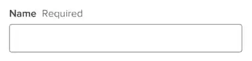

# Form Fields - `<Form.Item>`

An interface between the from and an native input.

## Getting Started

The `<Form.Item>` allows you to define a piece of state within a `<Form>`. They will usually have a input component as the direct descendant. The only required prop is `name` which will defines the field's name within the form's state.

```jsx
<Form>
  <Form.Item name="firstName">
    <Form.TextInput label="First Name" />
  </Form.Item>
</Form>
```

The form's state would now look like this,

```js
{
  "firstName": {
    value: null,
    defaultValue: null,
    edited: false,
    errors: Set<string>
  }
}
```

[Here is a link](https://developer.mozilla.org/en-US/docs/Web/JavaScript/Reference/Global_Objects/Set#examples) to the documentation for `Set` on MDN.

## Attributes

### Required

The `required` prop adds the "Required" text to the input's label as seen below. It does not run any requirement validation on submission.



```jsx
<Form.Item name="firstName" required>
</Form.Item>
```

### Validation

The `validation` prop runs a callback to check if the field value is allowed. These callbacks are ran when the form is submitted. Let's add one to the `<Form.Item>`,

```jsx
<Form.Item name="firstName" required validation={handleValidateFirstName}>
</Form.Item>
```

We can then define the `handleValidateFirstName` callback,

```tsx
function handleValidateFirstName(
  name: keyof MyForm,
  field: FormField<string>,
  addError: ValidationAddError
): void {
  if (!field.value?.trim()) {
    return addError("This field is required.");
  }
}
```

These function can be placed outside of your components unless it relies on a prop or internal state.

## API

### Values

- **name** ( Required ): `string`<br />
  The key in which this item will be registered to and accessible within the form.

- **defaultValue** ( Optional ): `unknown`<br />
  The value the input will be set to on first render and will be reset to if the form is cleared.

- **required** ( Optional ): `boolean`<br />
  A flag to show the "required" text in the label. This will **not** validate the input.

- **persist** ( Optional ): `boolean`<br/>
  When the `<Form.Item>` unmounts it will not remove it's field from state.

- **children** ( Optional ): `ReactNode`<br />
  The form inputs to be rendered within the form item. `<Form.Item>`s should only have inputs, input utilities and composed inputs as their children.

## Methods

- **validation** ( Optional ): `Validation<unknown>`<br/>
  A memoized validation function that will run on submission of the form.<br />
  If this function reports an error the form submition will fail.

- **onChange** ( Optional ): `(name: string, value: unknown, form: FormFields<any>) => void`<br />
  Callback function for when in input is updated.


## A deeper dive