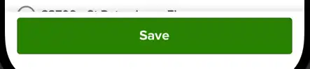

# Submit Button - `<Form.SubmitButton>`

A `<Pressable>` button that handles pressing submit on the form. It also has a build in loading indicator as show below.



```jsx
<Form onFinish={handleFinish}>
  <Form.Item name="firstName">
    <Form.TextInput label="First Name" />
  </Form.Item>
  <Form.SubmitButton>Save</Form.SubmitButton>
</Form>
```

## API

Extends the `ButtonProps` from [@components/Button](../../../Button/index.tsx).

### Values

- **status** ( Optional ): `FormStatus`<br />
  The status of the form. Valid options are `idle`, `submitting`, `failed`, `success`.<br />
  When the status is `loading` the button will show an activity indicator.

- **activityIndicatorProps** ( Optional ): `ActivityIndicatorProps`<br />
  Props passed to the activity indicator.

- **textProps** ( Optional ): `TextThemeProps`<br />
  Props passed to the text component that wraps the children. Primarily used to style the text.