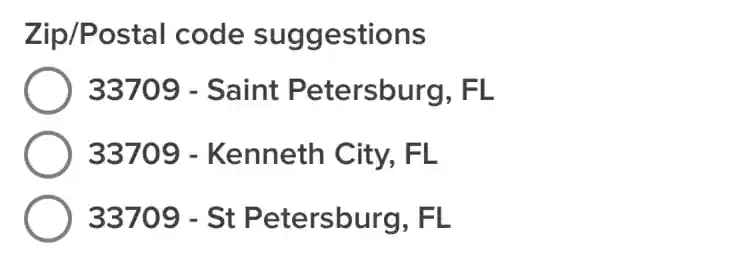

# Radio Group - `<Form.RadioGroup />`

A wrapper for containing the `<Form.RadioButton>` components.



## Getting Started

The radio group requires a `label` and at least one child component.

```tsx
return (
  <Form>
    <Form.Item name="country">
      <Form.RadioGroup label="Zip/Postal code suggestions">
        <Form.RadioButton value="33712">33712 - Saint Petersburg, FL</Form.SelectItem>
      </Form.Select>
    </Form.Item>
  </Form>
);
```

## API

## Values

- **label** ( Required ): `string`<br />
  The label displayed above the input. Can be hidden with the `hideLabel` prop.

- **hideLabel** ( Optional ): `boolean`<br />
  Hides the label from the UI but, the label is still used to describe the input for accessability.

- **helperText** ( Optional ): `string`<br />
  Text below the label to add additional context to the input or restrictions for the input.

- **labelProps** ( Optional ): `LabelProps`<br />
  Props passed to the `<Label>` component.

- **radio**: ( Optional ): `UseRadio`<br />
  Instance returned from the `Form.useRadio` hook. Used to data outside of the radio component.

- **state** ( Optional ): `InputState`<br />
  The state the input is in. Either "disabled" | "error".

- **containerProps** ( Optional ): `ViewProps`<br />
  Props passed to the wrapping `<View>` component. This component wraps the label, input, and error components.

- **inputContainerProps** ( Optional ): `ViewProps`<br />
  Props passed to to the `<View>` component wrapping the input components.

- **inputProps** ( Optional ): `TextInputProps & { defaultValue?: unknown }`<br />
  Props passed to the `<Input>` component.

- **errorProps** ( Optional ): `ErrorProps`<br />
  Props passed to the `<Error>` component.

- **children** ( Optional ): `ReactNode`<br />

# Radio Button - `<Form.RadioButton />`

A `Pressable` component used within a `Form.RadioGroup` for selecting an item.

## API

### Values

- **value** ( Required ): `unknown`<br />
  The value that will be used in the `onUpdate` method in the `<Form.RadioGroup>` component.

- **label** ( Required ): `string`<br />
  The text used to describe the radio option.

- **id** ( Optional ): `string`<br />

- **hideLabel** ( Optional ): `boolean`<br />
  Hides the label from the UI but, the label is still used to describe the input for accessability.

- **helperText** ( Optional ): `string`<br />
  Text below the label to add additional context to the input or restrictions for the input.

- **labelProps** ( Optional ): `LabelProps`<br />
  Props passed to the `<Label>` component.

- **containerProps** ( Optional ): `ViewProps`<br />
  Props passed to the wrapping `<View>` component. This component wraps the label, input, and error components.

- **inputContainerProps** ( Optional ): `ViewProps`<br />
  Props passed to to the `<View>` component wrapping the input components.

- **inputProps** ( Optional ): `TextInputProps & { defaultValue?: unknown }`<br />
  Props passed to the `<Input>` component.

- **testID** ( Optional ): `string`<br />
  Id used by QA for automated testing
