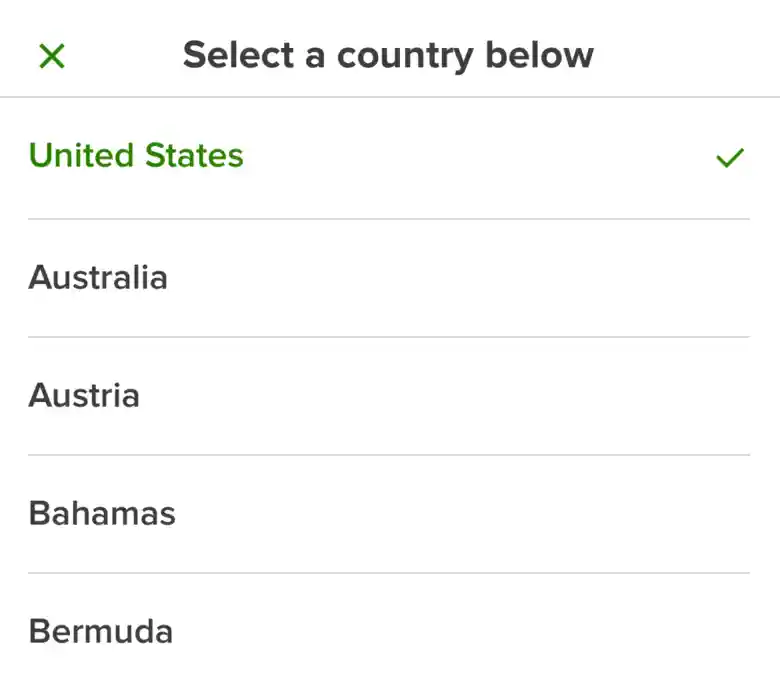

# Select Input - `<Form.Select />`

An pre-composed component that allows the user to select a value from a list of options.




## Getting Started

The select requires a `label` and at least one child component.

```tsx
return (
  <Form>
    <Form.Item name="country">
      <Form.Select label="Country">
        <Form.SelectItem value="us">United States</Form.SelectItem>
      </Form.Select>
    </Form.Item>
  </Form>
);
```

Use the `<Form.SelectHeader>` component alongside the `stickyHeader` prop to add a header to the select's modal.

```tsx
return (
  <Form>
    <Form.Item name="country">
      <Form.Select label="Country" stickyHeader>
        <Form.SelectHeader title="Please select a country below" />
        <Form.SelectItem value="us">United States</Form.SelectItem>
      </Form.Select>
    </Form.Item>
  </Form>
);
```

For a multi select input, add the `multi` prop.

```tsx
return (
  <Form>
    <Form.Item name="country">
      <Form.Select label="Country" multi stickyHeader>
        <Form.SelectHeader title="Please select a country below" />
        <Form.SelectItem value="us">United States</Form.SelectItem>
        <Form.SelectItem value="ca">Canada</Form.SelectItem>
      </Form.Select>
    </Form.Item>
  </Form>
);
```

## API - `<Form.Select>`

### Values

- **label** ( Required ): `string`<br />
  The label displayed above the input. Can be hidden with the `hideLabel` prop.

- **hideLabel** ( Optional ): `boolean`<br />
  Hides the label from the UI but, the label is still used to describe the input for accessability.

- **helperText** ( Optional ): `string`<br />
  Text below the label to add additional context to the input or restrictions for the input.

- **labelProps** ( Optional ): `LabelProps`<br />
  Props passed to the `<Label>` component.

- **stickyHeader** ( Optional ): `boolean`<br />
  Sticks the first item in the `<SelectModal>` to the top of the modal.

- **multi** ( Optional ): `boolean`<br />
  Allows more than one option to be selected within the modal.

- **state** ( Optional ): `InputState`<br />
  The state the input is in. Either "disabled" | "error".

- **containerProps** ( Optional ): `ViewProps`<br />
  Props passed to the wrapping `<View>` component. This component wraps the label, input, and error components.

- **inputContainerProps** ( Optional ): `ViewProps`<br />
  Props passed to to the `<View>` component wrapping the input components.

- **inputProps** ( Optional ): ` InputEvents<PressableProps> & { defaultValue?: unknown }`<br />
  Props passed to the `<Select>` component.

- **errorProps** ( Optional ): `ErrorProps`<br />
  Props passed to the `<Error>` component.

- **children** ( Required ): `ReactNode`<br />

## API - `<Form.SelectItem>`

### Values

- **value** ( Required ): `string | number`<br />
  The value that will be used for the `onUpdate` callback.

- **label** ( Optional ): `string | number`<br />
  The label for the select item. This prop can be used instead of passing children if desired.

- **pressableProps** ( Optional ): `PressableProps`<br />
  Props passed to the `<Pressable>` component that wraps the `<SelectItem>` children / label.

- **textProps** ( Optional ): `TextThemeProps`<br />
  Props passed to the `<Text>` component that wraps the children / label.

- **children** ( Optional ): `ReactNode`<br />
  Used when `label` is not used.

## API - `<Form.SelectHeader>`

### Values

- **title** ( Required ): `string`<br />

- **titleProps** ( Optional ): `TextThemeProps`<br />
  Props passed to the `<Text>` component wrapping the `title` prop.

- **subtitle** ( Optional ): `string`<br />

- **subtitleProps** ( Optional ): `TextThemeProps`<br />
  Props passed to the `<Text>` component wrapping the `subtitle` prop.
