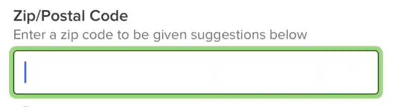
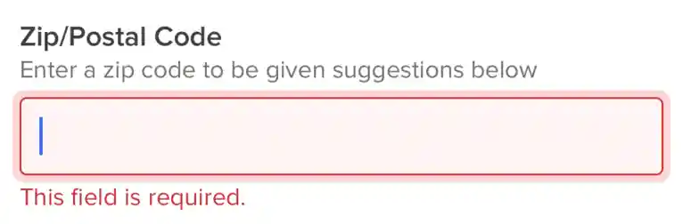
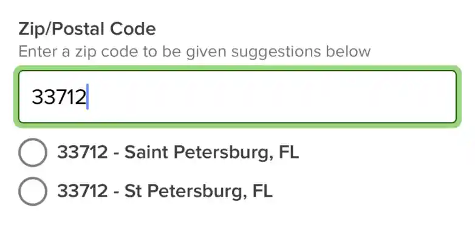

# Zip Code Input - `<Form.ZipCodeInput />`

An pre-composed component that allows the user to enter a zip code into a text field.




## Getting Started

This input only requires the `label` prop but the label can be hidden with the `hideLabel` prop.

```tsx
return (
  <Form>
    <Form.Item name="zip">
      <Form.ZipCodeInput label="Zip/Postal Code" />
    </Form.Item>
  </Form>
);
```

For zip code suggestions, see the section below covering the `<Form.ZipCodeSuggestions>` component.

## API

### Values

- **label** ( Required ): `string`<br />
  The label displayed above the input. Can be hidden with the `hideLabel` prop.

- **hideLabel** ( Optional ): `boolean`<br />
  Hides the label from the UI but, the label is still used to describe the input for accessability.

- **helperText** ( Optional ): `string`<br />
  Text below the label to add additional context to the input or restrictions for the input.

- **labelProps** ( Optional ): `LabelProps`<br />
  Props passed to the `<Label>` component.

- **state** ( Optional ): `InputState`<br />
  The state the input is in. Either "disabled" | "error".

- **containerProps** ( Optional ): `ViewProps`<br />
  Props passed to the wrapping `<View>` component. This component wraps the label, input, and error components.

- **inputContainerProps** ( Optional ): `ViewProps`<br />
  Props passed to to the `<View>` component wrapping the input components.

- **inputProps** ( Optional ): `TextInputProps & { defaultValue?: unknown }`<br />
  Props passed to the `<Input>` component.

- **errorProps** ( Optional ): `ErrorProps`<br />
  Props passed to the `<Error>` component.

- **children** ( Optional ): `ReactNode`<br />

# Zip Code Suggestions - `<Form.ZipCodeSuggestions />`

An pre-composed component that handles loading and displaying zip codes based on the value from a `<Form.ZipCodeInput>` component.



## Getting Started

There are no required props for the `<Form.ZipCodeSuggestions />` component.

```tsx
return (
  <Form>
    <Form.Item name="zip">
      <Form.ZipCodeInput label="Zip/Postal Code">
        <Form.ZipCodeSuggestions />
      </Form.ZipCodeInput>
    </Form.Item>
  </Form>
);
```

## Using the city and state data via `onChange`

A common use case maybe setting a form field for city and state based on the zip code selected within the `<Form.ZipCodeSuggestions />` component.

```tsx
function handleSelectZipCodeSuggestion(event: StateAndCitySuggestion): void {
  form.setManyValue({
    city: event.city,
    state: event.state,
  });
}

return (
  <Form>
    <Form.Item name="zip">
      <Form.ZipCodeInput label="Zip/Postal Code">
        <Form.ZipCodeSuggestions onChange={handleSelectZipCodeSuggestion} />
      </Form.ZipCodeInput>
    </Form.Item>
    <Form.Item name="city" />
    <Form.Item name="state" />
  </Form>
);
```

In the example above there are two hidden inputs that will hold the city and state values from the `<Form.ZipCodeSuggestions />`. when submitting the form those fields will be available like the other fields.

```ts
function handleFinish(
  event: FormFields<{ zip: string; city: string; state: string }>,
): void {
  console.log(event.city.value);
}
```

## API

### Values

- **zipSuggestions** ( Optional ): `UseZipSuggestions`<br />
  Instance returned from the `Form.useZipSuggestions` hook. Used to data outside of the suggestions component.

- **refetchDelay** ( Optional ): `number`<br />
  Amount of time needed between keystrokes before triggering a refetch of suggestions.

- **containerProps** ( Optional ): `ViewProps`<br />
  Props passed to the wrapping `<View>` component.

- **suggestionLoadingProps** ( Optional ): `SuggestionLoadingProps`<br />
  Props passed to the `<SuggestionLoading>` component that is displayed while the fetching new zip codes.

- **suggestionErrorProps** ( Optional ): `SuggestionErrorProps`<br />
  Props passed to the `<SuggestionError>` component that is displayed when there was an fetching zip code suggestions.

- **suggestionNotFoundProps** ( Optional ): `SuggestionNotFoundProps`<br />
  Props passed to the `<SuggestionNotFound>` component that is displayed when no suggestions where returned from the API.

- **radioGroupProps** ( Optional ): `RadioGroupProps`<br />
  Props passed to the `<RadioGroup>` component used to wrap the suggestions.

- **radioButtonProps** ( Optional ): `RadioButtonProps`<br />
  Props passed to the `<RadioButton>` component used to display each suggestion.

### Methods

- **onChange** ( Optional ): `(value: StateAndCitySuggestion) => void`<br />
  Runs each time a suggestion is selected.

# `Form.useZipSuggestions`

Allows the developer to get data outside of the `<Form.ZipCodeSuggestions />` component.

```tsx
const zipSuggestions = Form.useZipSuggestions();

return (
  <Form>
    <Form.Item name="zip">
      <Form.ZipCodeInput label="Zip/Postal Code">
        <Form.ZipCodeSuggestions zipSuggestions={zipSuggestions} />
      </Form.ZipCodeInput>
    </Form.Item>
  </Form>
);
```

## API

The Form.useZipSuggestions is a [TranStack mutation](https://tanstack.com/query/v4/docs/react/reference/useMutation) and follows their API with the type `UseMutationResult<StateAndCitySuggestion[]>`
